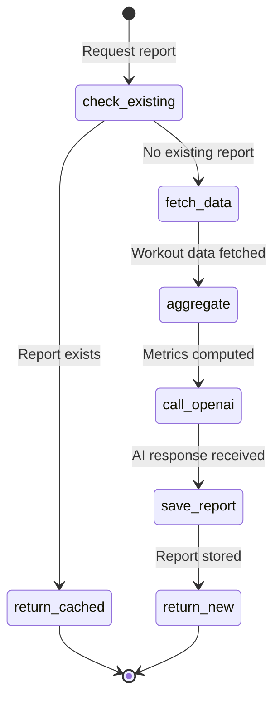
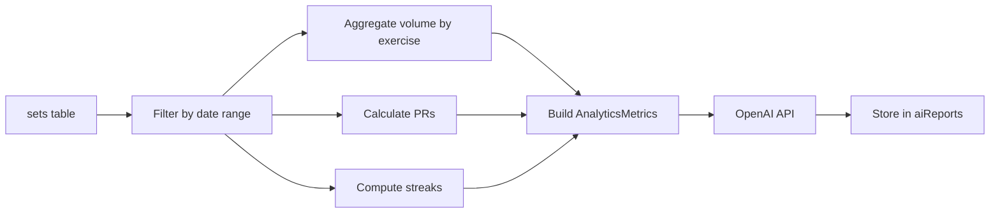
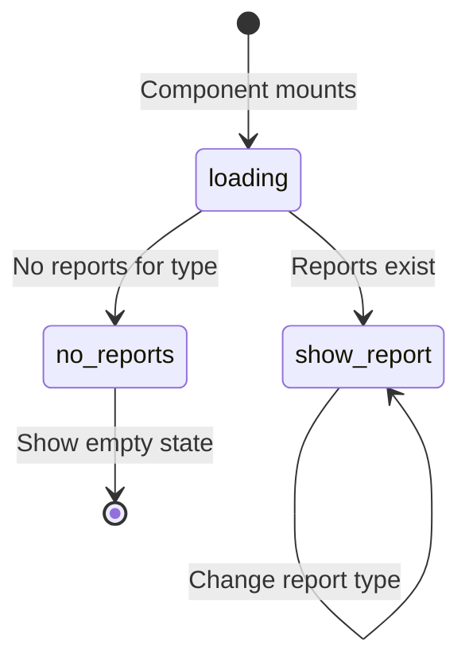

# AI Report Generation Flow

How workout analysis reports are generated, cached, and displayed.

## Report Types

| Type | Period | Schedule |
|------|--------|----------|
| `daily` | Last 24 hours | On-demand |
| `weekly` | Monday-Sunday | Cron + on-demand |
| `monthly` | Calendar month | Cron |

## Generation Flow



## Deduplication

Reports are keyed by `(userId, reportType, weekStartDate)`:

```typescript
const existingReportId = await ctx.runQuery(
  internal.ai.data.checkExistingReport,
  { userId, reportType, weekStartDate }
);

if (existingReportId) {
  return existingReportId; // Return cached
}
```

## Data Pipeline



## Report Navigator UI States



## Cron Schedule

From `/convex/crons.ts`:

- Weekly reports: Triggered via cron for subscribed users
- Report generation is idempotent (deduplication prevents duplicates)

## Report Versions

| Version | Content Field | Renderer |
|---------|--------------|----------|
| `1.0` (default) | `content` (markdown) | `AIInsightsCard` |
| `2.0` | `structuredContent` (JSON) | `AIReportCardV2` |

## Files

- `/convex/ai/generate.ts` - Report generation action
- `/convex/ai/generateV2.ts` - V2 structured reports
- `/convex/ai/data.ts` - Data fetching queries
- `/convex/ai/openai.ts` - OpenAI API wrapper
- `/src/components/analytics/report-navigator.tsx` - UI navigation
- `/src/components/analytics/ai-insights-card.tsx` - V1 renderer
- `/src/components/analytics/report-v2/` - V2 renderer
