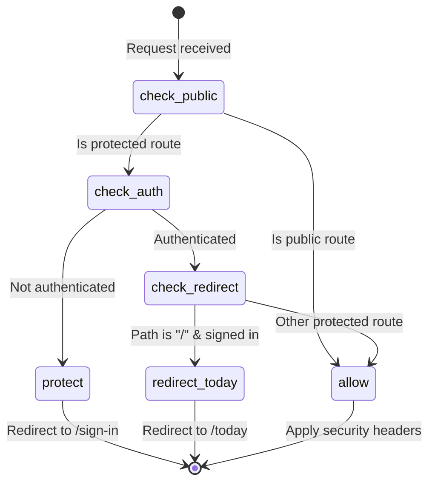
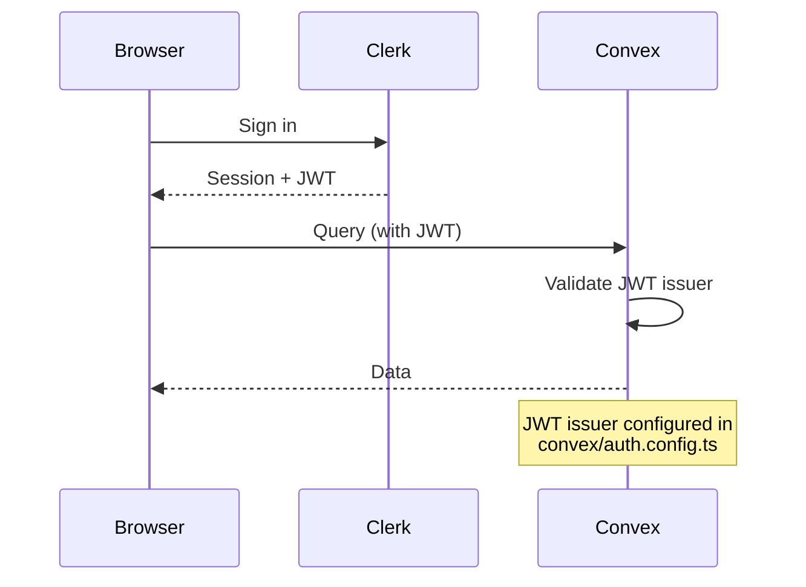

# Authentication Flow

How Clerk and Convex coordinate to authenticate users.

## Architecture

```
Browser <-> Clerk <-> Middleware
                  <-> Convex (JWT validation)
```

## Middleware Flow



## Public Routes

Routes accessible without authentication:

- `/` - Landing page
- `/sign-in(.*)` - Auth pages
- `/sign-up(.*)` - Auth pages
- `/terms`, `/privacy` - Legal
- `/pricing` - Subscription page
- `/api/health` - Monitoring

## Clerk-Convex Integration



## User Record Creation

Convex creates user record on first authenticated access:

1. `PaywallGate` calls `getOrCreateUser`
2. Creates user with 14-day trial
3. Stores `clerkUserId` for cross-reference

## Security Headers

Applied to all responses via middleware:

- `Content-Security-Policy` - Script/style sources
- `X-Frame-Options: DENY` - Clickjacking protection
- `X-Content-Type-Options: nosniff` - MIME sniffing
- `Strict-Transport-Security` - HTTPS enforcement

## Files

- `/src/middleware.ts` - Route protection, security headers
- `/convex/auth.config.ts` - JWT issuer configuration
- `/src/app/ConvexClientProvider.tsx` - Clerk-Convex bridge
- `/convex/users.ts` - User record management
