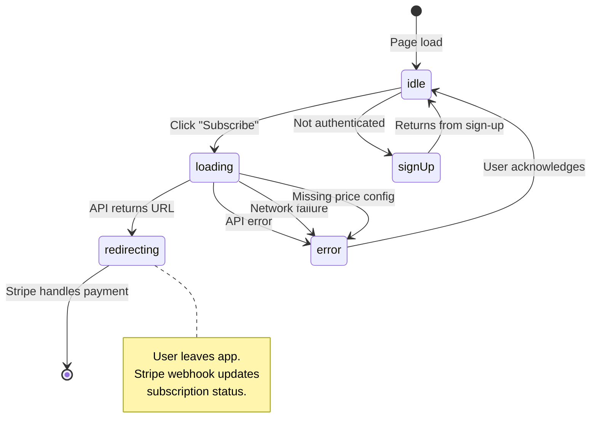
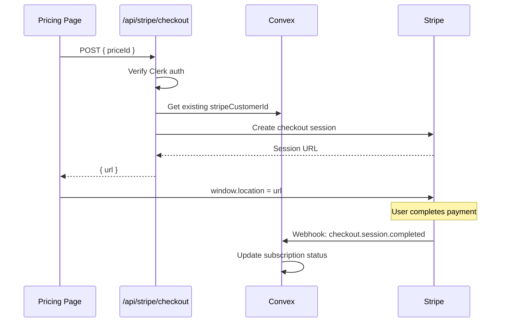

# Checkout Flow State Machine

User journey from pricing page to active subscription.

## States

| State | UI | Next |
|-------|----|----|
| `idle` | Plan selection visible | loading |
| `loading` | Spinner, button disabled | redirecting, error |
| `redirecting` | Window navigating to Stripe | (external) |
| `error` | Error message shown | idle (retry) |
| `success` | Redirect to `/today?checkout=success` | - |

## State Diagram

## Checkout API Flow

## Error States

| Error | User Message | Recovery |
|-------|--------------|----------|
| Missing priceId | "Payment configuration error" | Retry later |
| API 500 | "Something went wrong" | Retry |
| Network error | "Connection error" | Check internet |

## IDOR Prevention

The checkout API fetches `stripeCustomerId` server-side from Convex using the authenticated user's token, preventing attackers from using another user's Stripe customer ID.

## Files

- `/src/app/pricing/page.tsx` - Checkout UI and state management
- `/src/app/api/stripe/checkout/route.ts` - Checkout session creation
- `/convex/subscriptions.ts` - `getStripeCustomerId` query
