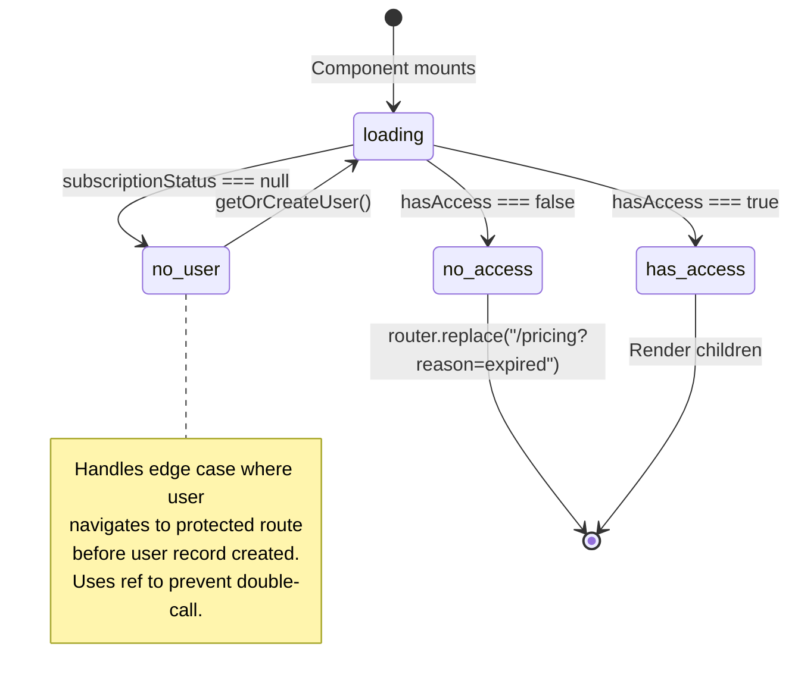
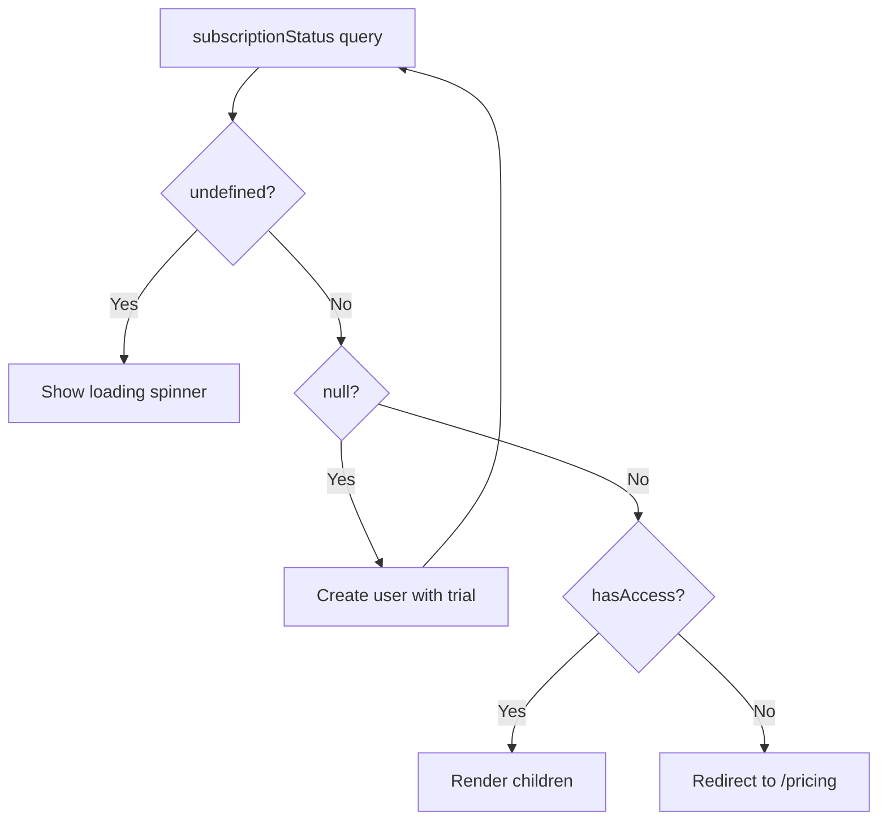

# PaywallGate Access Control Flow

Component that wraps authenticated routes to enforce subscription access.

## States

| State | UI | Action |
|-------|----|----|
| `loading` | Spinner | Wait for query |
| `no_user` | Spinner | Auto-create user |
| `has_access` | Children rendered | None |
| `no_access` | Spinner | Redirect to pricing |

## State Diagram



## Race Condition Prevention

```typescript
const userCreationAttempted = useRef(false);

// Only attempt once per mount
if (subscriptionStatus === null && !userCreationAttempted.current) {
  userCreationAttempted.current = true;
  getOrCreateUser({ timezone });
}
```

The `useRef` flag prevents multiple user creation attempts during React's strict mode double-mounting or rapid re-renders.

## Access Decision Flow



## Files

- `/src/components/subscription/paywall-gate.tsx` - Gate component
- `/src/app/(app)/layout.tsx` - Where gate is applied
- `/convex/users.ts` - `getSubscriptionStatus`, `getOrCreateUser`
