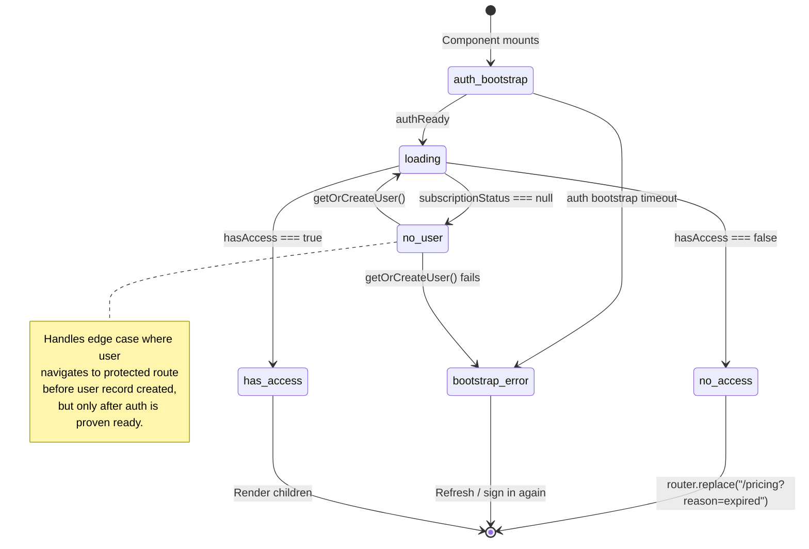
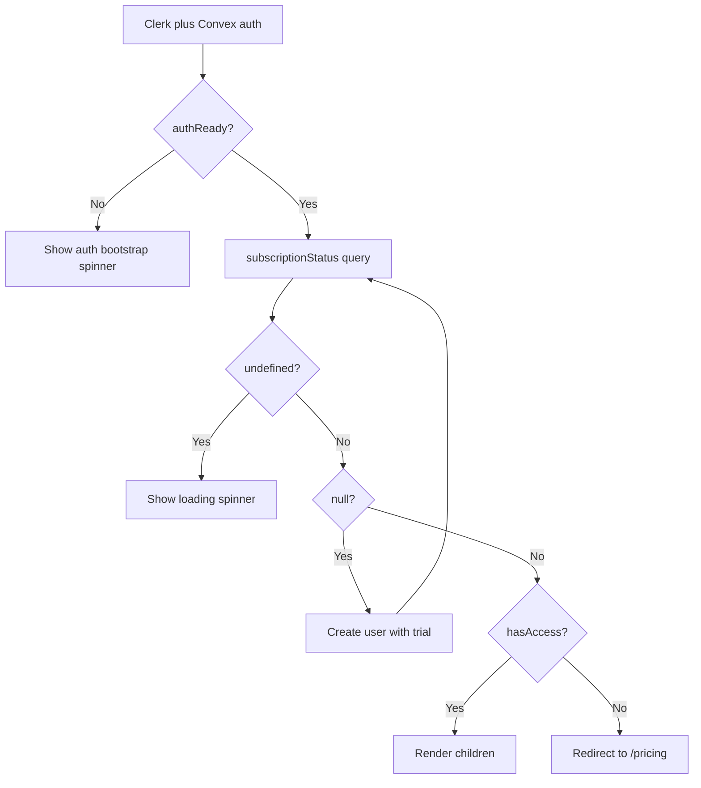

# PaywallGate Access Control Flow

Component that wraps authenticated routes to enforce subscription access.

## States

| State             | UI                | Action                                |
| ----------------- | ----------------- | ------------------------------------- |
| `auth_bootstrap`  | Spinner           | Wait for Clerk + Convex auth to agree |
| `loading`         | Spinner           | Wait for subscription query           |
| `no_user`         | Spinner           | Auto-create user after auth is ready  |
| `has_access`      | Children rendered | None                                  |
| `no_access`       | Spinner           | Redirect to pricing                   |
| `bootstrap_error` | Recovery UI       | Refresh / investigate auth failure    |

## State Diagram


```mermaid
stateDiagram-v2
    [*] --> auth_bootstrap: Component mounts

    auth_bootstrap --> loading: authReady
    auth_bootstrap --> bootstrap_error: auth bootstrap timeout
    loading --> no_user: subscriptionStatus === null
    loading --> has_access: hasAccess === true
    loading --> no_access: hasAccess === false

    no_user --> loading: getOrCreateUser()
    no_user --> bootstrap_error: getOrCreateUser() fails
    note right of no_user
        Handles edge case where user
        navigates to protected route
        before user record created,
        but only after auth is proven ready.
    end note

    no_access --> [*]: router.replace("/pricing?reason=expired")
    bootstrap_error --> [*]: Refresh / sign in again

    has_access --> [*]: Render children
```

## Race Condition Prevention

```typescript
const authReady =
  isClerkLoaded && Boolean(userId) && !isConvexAuthLoading && isAuthenticated;

// Don't query subscription state until auth is actually ready
const subscriptionStatus = useQuery(
  api.users.getSubscriptionStatus,
  authReady ? {} : "skip"
);

// Only attempt user creation after auth is ready
if (
  authReady &&
  subscriptionStatus === null &&
  !userCreationAttempted.current
) {
  userCreationAttempted.current = true;
  getOrCreateUser({ timezone });
}
```

This separation prevents the gate from mistaking "auth still bootstrapping" for
"authenticated user record missing."

## Access Decision Flow


```mermaid
flowchart TD
    A[Clerk plus Convex auth] --> B{authReady?}
    B -->|No| C[Show auth bootstrap spinner]
    B -->|Yes| D[subscriptionStatus query]
    D --> E{undefined?}
    E -->|Yes| F[Show loading spinner]
    E -->|No| G{null?}
    G -->|Yes| H[Create user with trial]
    H --> D
    G -->|No| I{hasAccess?}
    I -->|Yes| J[Render children]
    I -->|No| K[Redirect to /pricing]
```

## Files

- `/src/components/subscription/paywall-gate.tsx` - Gate component
- `/src/app/(app)/layout.tsx` - Where gate is applied
- `/convex/users.ts` - `getSubscriptionStatus`, `getOrCreateUser`
