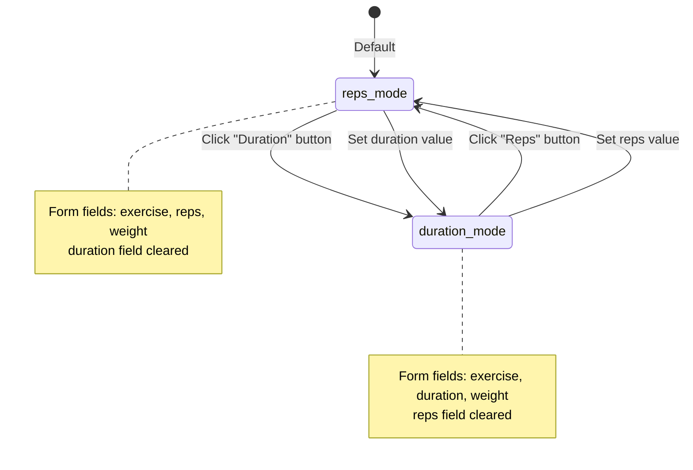
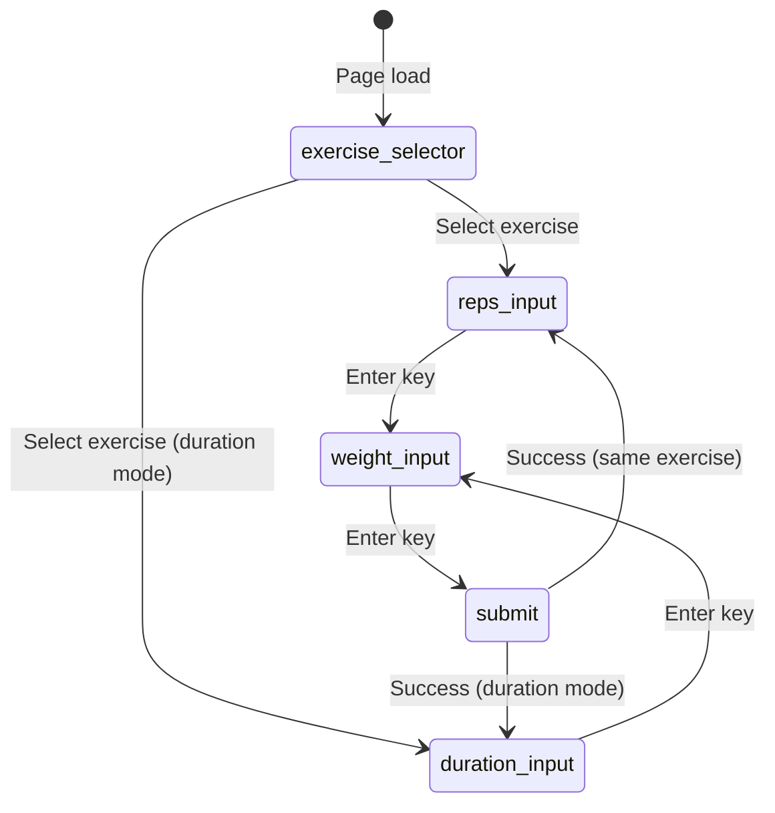
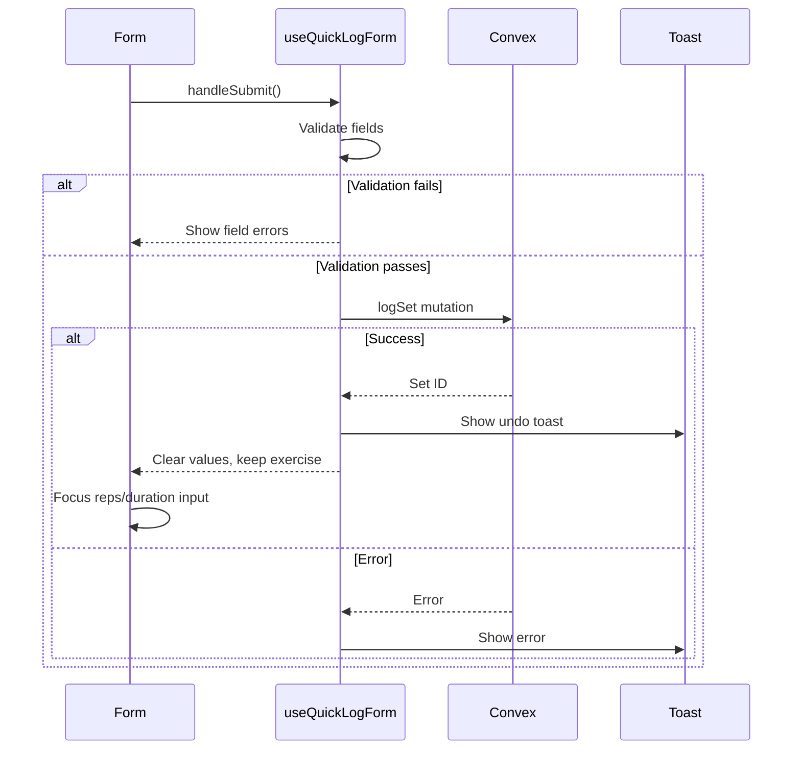

# Quick Log Form State Machine

The main workout logging form with reps/duration mode switching and keyboard navigation.

## Input Mode States



## Focus Flow (Keyboard Navigation)



## Form Submission Flow



## Mode Switching Logic

```typescript
// Watching form values to auto-clear opposing field
useEffect(() => {
  const subscription = form.watch((value, { name }) => {
    if (name === "reps" && value.reps !== undefined) {
      form.setValue("duration", undefined);
      setIsDurationMode(false);
    } else if (name === "duration" && value.duration !== undefined) {
      form.setValue("reps", undefined);
      setIsDurationMode(true);
    }
  });
  return () => subscription.unsubscribe();
}, [form]);
```

## Focus Management

The form uses `requestAnimationFrame` for reliable focus after dialog close:

```typescript
const focusElement = (ref: React.RefObject<HTMLInputElement | null>) => {
  requestAnimationFrame(() => {
    if (ref.current && document.contains(ref.current)) {
      ref.current.focus();
    }
  });
};
```

100ms delay after exercise selection ensures DOM updates complete before focusing.

## Files

- `/src/components/dashboard/quick-log-form.tsx` - Form component
- `/src/hooks/useQuickLogForm.ts` - Form logic and validation
- `/src/components/dashboard/duration-input.tsx` - Duration field
- `/src/components/dashboard/exercise-selector-dialog.tsx` - Exercise picker
