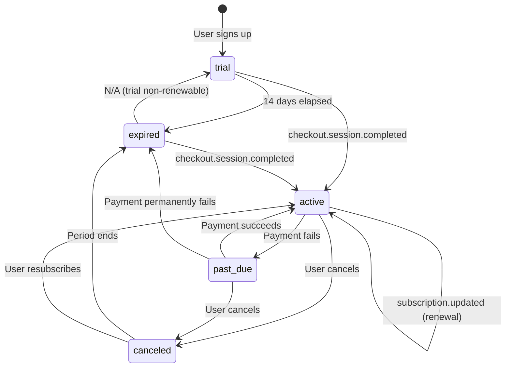

# Subscription Lifecycle State Machine

This document describes the subscription state machine that controls user access to Volume.

## States

| State | Description | Has Access |
|-------|-------------|------------|
| `trial` | New user, within 14-day free period | Yes |
| `active` | Paid subscription, auto-renewing | Yes |
| `past_due` | Payment failed, Stripe retrying | Yes (grace) |
| `canceled` | User canceled, still within paid period | Yes (until periodEnd) |
| `expired` | Trial ended or subscription fully lapsed | No |

## State Diagram



## Transition Triggers

### Client-Initiated
- **Sign up**: `getOrCreateUser` mutation creates user with `trial` status
- **Checkout**: POST `/api/stripe/checkout` creates Stripe session
- **Cancel**: Stripe billing portal (user-initiated)

### Webhook-Initiated (Stripe -> Convex)
- **checkout.session.completed**: Links Stripe customer, activates subscription
- **customer.subscription.updated**: Status changes (renewal, payment retry)
- **customer.subscription.deleted**: Subscription fully terminated

## Access Logic

```typescript
const hasAccess =
  status === "active" ||
  status === "past_due" ||
  (status === "trial" && trialEndsAt > now) ||
  (status === "canceled" && subscriptionPeriodEnd > now);
```

## Error Handling

**Webhook Failures**: Mutations throw on missing user to trigger Stripe retry.

```
No user found -> Error thrown -> Stripe retries (up to 72 hours)
```

**Race Condition Mitigation**: `handleCheckoutCompleted` uses `clerkUserId` from metadata to find user atomically, avoiding timing issues between Clerk auth and Stripe webhooks.

## Files

- `/convex/users.ts` - `getSubscriptionStatus`, `getOrCreateUser`
- `/convex/subscriptions.ts` - Webhook handlers
- `/convex/http.ts` - Stripe webhook router
- `/src/components/subscription/paywall-gate.tsx` - Access enforcement
- `/src/app/api/stripe/checkout/route.ts` - Checkout session creation
