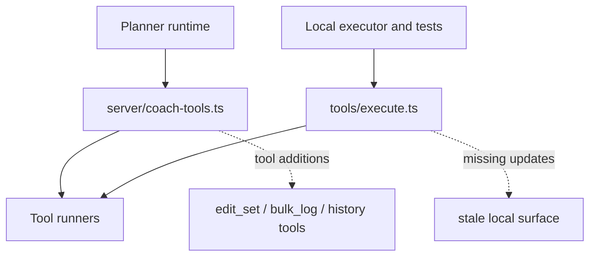
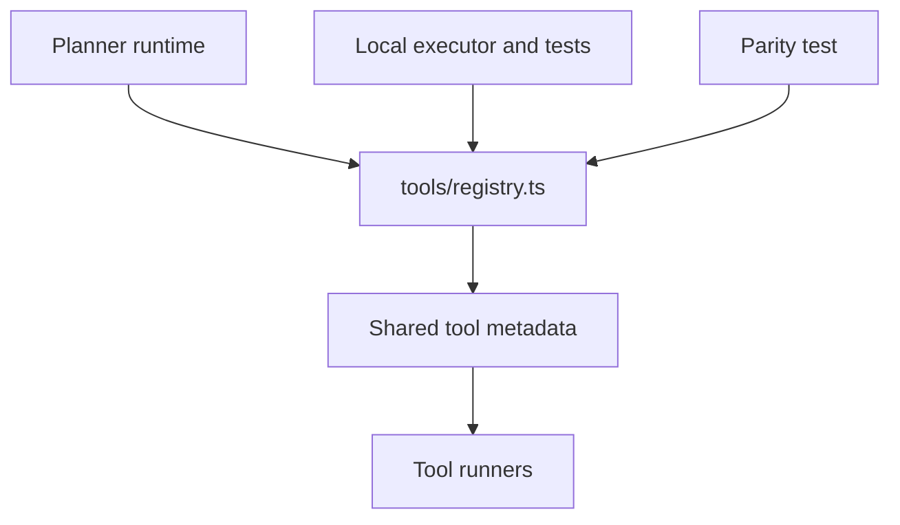

# Coach Tool Registry Walkthrough

## Title

Single-source coach tool registry removes drift between planner tools and local execution.

## Why Now

The coach runtime exposed newer tools through `createCoachTools`, but `executeCoachTool`
kept a second, stale registry. That meant routine tool additions required edits in two
places, and one path had already fallen behind.

## Before



Evidence:

- [src/lib/coach/server/coach-tools.ts](../src/lib/coach/server/coach-tools.ts)
- [src/lib/coach/tools/execute.ts](../src/lib/coach/tools/execute.ts)

## What Changed

Moved tool names, descriptions, schemas, and runner wiring into
`src/lib/coach/tools/registry.ts`. Both the AI SDK factory and the local executor now
derive from that module.

## After



Evidence:

- [src/lib/coach/tools/registry.ts](../src/lib/coach/tools/registry.ts)
- [src/lib/coach/server/coach-tools.test.ts](../src/lib/coach/server/coach-tools.test.ts)
- [src/lib/coach/tools/execute.test.ts](../src/lib/coach/tools/execute.test.ts)

## Verification

```bash
bun run test --run \
  src/lib/coach/tools/execute.test.ts \
  src/lib/coach/server/coach-tools.test.ts \
  src/lib/coach/agent-tools.test.ts \
  src/lib/coach/server/planner.test.ts

bun run typecheck
```

Observed result:

- 4 coach suites passed
- 38 tests passed
- `bun run typecheck` passed

## Residual Risk

`useCoachChat` and planner suggestion text still duplicate some tool-name knowledge.
This PR only removes registry drift; it does not yet centralize client-facing prompt copy.

## Merge Case

This branch deletes a shallow duplicated boundary, fixes a real parity gap for newer
coach tools, and adds a regression test that keeps both execution paths aligned.
